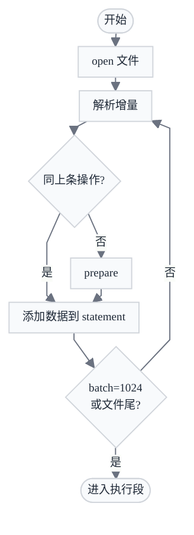
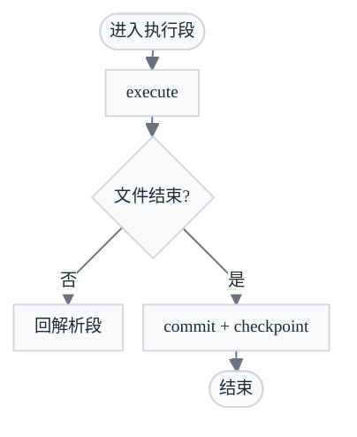
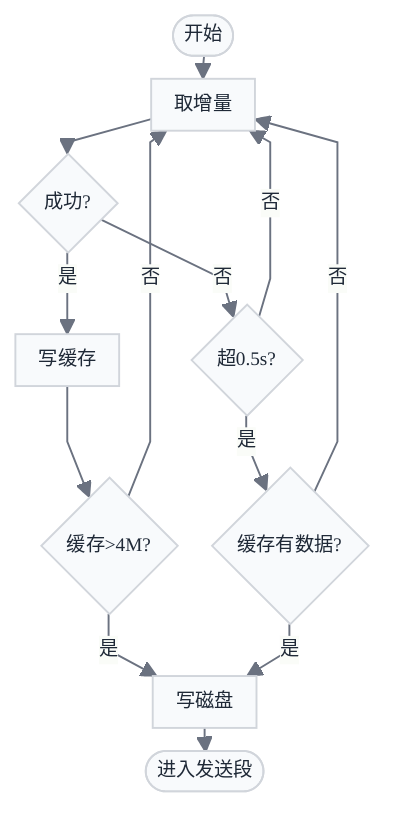
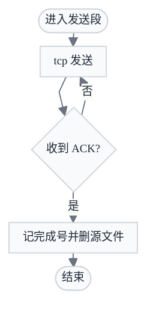

  

    
    

    
数据库同步专家

  

  

    
产品能力介绍

    <h1 style="font-size: 2.5rem; font-weight: 700; color: var(--ink); line-height: 1.1; letter-spacing: -0.015em; background: none; padding: 0; margin: 0">FZS 数据同步平台</h1>
    
Financial-grade Zero-lag Sync 金融级零延迟数据库同步

    

      金融街证券 · 2026 年 6 月 1 日
    

  

---
layout: default
---

# 目录

01什么是 FZS？

02支持的数据库链路

03三种同步模式

04数据同步原理

05管理控制台一览

06链路配置 · 监控 · 告警

07高可用 · 自动容灾

08数据比对与校验

09AI 助手

10性能测试 · 信创认证

13典型应用场景 · 案例分享

金融级 CDC · 异构同步 · 可视化运维 · AI 助手一体化

---
layout: default
---

# FZS 是什么？

产品特性

- **同步性能高**：捕获分析数据库重做日志 redo，数据高效实时同步
- **范围覆盖广**：主流商业库 + 国产信创库 / 数据湖仓 / 数据中间件
- **运维成本低**：UI 简单易用直观，软件支持容器化一键部署
- **智能体加持**：AI 助理赋能用户，使用自然语言实现运维操作

五大组件

| 组件 | 技术栈 | 职责 |
|------|------|------|
| **FZS Agent** | C | 抓取 + 装载（源/备端） |
| **FZS Web** | React / Remix | 可视化管理控制台 |
| **FZS Web Server** | C++ REST | Agent 调度网关 |
| **FZS Daemon** | Node.js | 告警监控 + 自动重启 |
| **FZS Query** | Java / Spring Boot | 数据比对与校验 |

完全自主研发 · CDC 实时同步 · 异构数据库 · AI 运维

---
layout: default
---

# 支持的数据库链路

可作为数据源（Source）

通过 CDC 日志抓取，覆盖商业库与国产信创库：

- Oracle DB
- MySQL / MariaDB
- PostgreSQL / openGauss / GaussDB
- SQL Server / DB2 / Informix
- OceanBase（Oracle / MySQL 模式）
- 达梦 DM / 金仓 KingBase
- 崖山 YashanDB / GoldenDB
- TiDB / TDSQL（MySQL / PostgreSQL）
- 海量数据 Vastbase G100 · MogDB

另支持 GBase8s · SUNDB · StarRocks · Hive 等，共 20+ 种数据源

可作为数据目标（Sink）

所有 Source 库均可作为目标；额外支持专属 Sink 目标：

| 目标类型 | 典型场景 |
|----------|---------|
| Apache Kafka | 事件流 / 下游消费 |
| Apache Doris / SelectDB | OLAP 分析 |
| Apache Iceberg | 湖仓一体 |
| Apache Paimon | 流批一体 |
| GaussDB DWS | 华为数仓 |
| PolarDB（MySQL/PG） | 阿里云 RDS |

17 种数据源 · 异构全覆盖 · 所有 Source 库均可作为 Sink 目标

---
layout: default
---

# 三种同步模式

01

<h3 class="font-bold mt-2" style="color: var(--ink); font-size: 1rem">实时模式</h3>

全量 + 增量

<ul class="mt-3 space-y-2" style="font-size: 0.88rem">
<li>先做全量快照，完成后自动切入 CDC 增量</li>
<li>中断后断点续传，不需重做全量</li>
<li>适合：数据容灾、实时集成</li>
</ul>

02

<h3 class="font-bold mt-2" style="color: var(--ink); font-size: 1rem">增量模式</h3>

仅增量

<ul class="mt-3 space-y-2" style="font-size: 0.88rem">
<li>跳过全量，直接从指定位点开始抓取 CDC</li>
<li>适合：源/备端数据已对齐后的持续同步，及灾备库完成初始化后的接管</li>
</ul>

03

<h3 class="font-bold mt-2" style="color: var(--ink); font-size: 1rem">迁移模式</h3>

仅全量

<ul class="mt-3 space-y-2" style="font-size: 0.88rem">
<li>只做一次性全量快照，不开启增量</li>
<li>同步对象：表数据、序列、视图、存储过程、约束、权限、表空间等</li>
<li>适合：信创替换、一次性数据迁移</li>
</ul>

定时调度：所有模式均支持 cron 调度与交易日历，非交易日自动暂停

---
layout: default
transition: slide-left
---

# 数据装载原理剖析

解析与组批阶段

执行与提交阶段

按操作类型复用 statement · 批满即执行 · 文件结束提交 checkpoint

---
layout: default
transition: slide-left
---

# 数据传输流程详解

采集/缓存/落盘阶段

发送/确认/清理阶段

4M 缓存阈值落盘 · 0.5s 超时兜底发送 · ACK 后删除源端文件

---
layout: default
---

# 管理控制台一览

- **仪表盘**：链路状态总览（运行 / 暂停 / 异常 / 闲置）、CPU / 内存负载、活跃链路列表
- **数据链路**：按分组管理，导航树快速定位，每条链路独立监控面板
- **操作审计**：所有操作留痕可追溯，满足金融合规要求
- **系统设置**：用户管理、告警策略、License 与 Agent 软件管理
- **深色 / 浅色主题**：跟随系统或手动切换
- **刷新频率**：10s / 30s / 60s 可配置

  

本地独立部署 · 无外部依赖 · 深色 / 浅色主题自适应 · 刷新频率 10s / 30s / 60s 可配

---
layout: default
---

# 链路配置：五步向导

**① 基础信息**：选择源端节点 → 备端节点，填写链路名称与描述

**② 同步对象**：用户级 / 表级 / 列级；支持名称映射、类型映射、列过滤（WHERE 条件）及备端加列

**③ 同步策略**：选择同步模式（全量+增量 / 仅增量 / 仅全量）；配置 cron 调度与交易日历

**④ 同步配置**：全量并发数、增量批次大小、网络压缩

**⑤ 其他配置**：告警绑定、分组归属、备注信息

  

同步对象粒度：用户级 / 表级 / 列级 · 名称映射 · 类型映射 · 列过滤 · 五步完成配置

---
layout: default
---

# 链路实时监控

**增量累计**：统计 INSERT / UPDATE / DELETE / DDL 在抓取端与装载端的累计行数，两端对比可发现积压或数据丢失

**实时延时**：独立展示抓取端与装载端的秒级延时，快速定位瓶颈在网络层还是目标库

**全量统计**：显示全量阶段的迁移进度、已同步行数与 QPS

  

抓取端 / 装载端双端延时独立监控 · 秒级定位瓶颈 · 全量 QPS 实时可见

---
layout: default
---

# 告警管理

  
  
<strong>报错告警</strong>：链路进入异常状态时立即触发，最长 30 秒内感知同步中断

  
  
<strong>延时告警</strong>：增量延时超过自定义阈值（秒）时触发，可按业务 RPO 要求自定义

  
  
<strong>空闲告警</strong>：源端在阈值时间内无数据变化时触发，检测业务静默或上游采集失效

  

通知渠道：Webhook（企微 / 钉钉 / 飞书 / 短信平台）+ SMTP 邮件

---
layout: default
---

# 高可用 · 自动容灾

Docker Swarm + Gluster 三节点

三节点混合集群，3 台节点同时承载 Swarm 管理与业务容器，任一节点故障不影响整体调度

Daemon 自动重启

FZS Daemon 每 **30 秒**检测所有配置了 Agent 的节点是否可达：

1. 若 Agent 进程宕机 → 自动触发重启命令
2. 若链路运行中断 → 自动恢复同步（可配置）
3. 所有恢复动作均写入系统日志，可追溯

实现链路级故障的无人值守自恢复，降低人工介入成本

主备切换 / 灾备切换

| 操作 | 说明 |
|------|------|
| **激活备端** | 将备库切换为可读写状态 |
| **主备切换** | 交换源端与备端角色，链路反向同步 |
| **灾备切换** | 一键将容灾备库提升为主库，RTO < 10 分钟 |

以上操作均可通过 Web UI 或 AI 助手完成，均需二次确认。

RTO &lt; 10 分钟 · RPO ≈ 0 · 无人值守自恢复 · Web UI 一键切换 · 操作前二次确认

---
layout: default
---

# 数据比对与校验

通过 **FZS Query**（独立 Java 服务）提供两层验证：

**快速行数比对**：并行查询源端与备端同名表的行数，秒级获取差异，即时判断是否一致

**逐行内容差异校验**：SQL 层对比实际数据，生成差异 Excel 文件供下载，精确定位不一致行；AI 助手可汇总差异摘要

  

行数比对秒级完成 · 差异明细导出 Excel · 支持 14 种数据库

---
layout: default
---

# AI 助手

**支持主流 LLM**：DeepSeek · 豆包 · 千问 · Kimi · 智谱 GLM · MiniMax；支持私有部署地址，适合内网隔离

- Web Server、数据节点的增删改查
- 链路的创建、启停、修复、重置、主备切换、灾备切换
- 告警阈值与通知渠道配置
- 数据比对、日志查询、坏表检查
- 导航分组管理、系统概览与日志

**边界约束**：遵守当前用户权限；高风险操作需二次确认；不能访问业务明细数据

  

    
  

  

    
  

  

    
  

支持私有部署 · 支持内网隔离 · 权限约束 · 高风险操作需二次确认

---
layout: default
---

# 性能测试

部署模式：中间机 · CPU 16c 海光 Dhyana · MEM 32 GB · 1–4 与竞品齐平 · 5–6 优于竞品

---
layout: default
---

# 信创适配认证

  

    
    
飞腾 产品兼容性证明

  

  

    
    
金仓 KingBase 兼容性认证证书

  

  

    
    
腾讯云 产品兼容性互认证明

  

飞腾 · 金仓 KingBase · 腾讯云 TDSQL · 共 9 项信创认证（1 / 3）

---
layout: default
---

# 信创适配认证

  

    
    
阿里云 产品生态集成认证

  

  

    
    
OceanBase 产品兼容互认证书

  

  

    
    
华为 HUAWEI COMPATIBLE 技术认证

  

阿里云 PolarDB · OceanBase · 华为 GaussDB · 共 9 项信创认证（2 / 3）

---
layout: default
---

# 信创适配认证

  

    
    
达梦数据库 产品兼容互认证证书

  

  

    
    
崖山 YashanDB 产品兼容互认证明

  

  

    
    
麒麟软件 适配认证

  

达梦 · 崖山 YashanDB · 麒麟软件 · 共 9 项信创认证（3 / 3）

---
layout: default
---

# 典型应用场景

  

    01
    

      <h3 style="color: oklch(97% 0.005 30); font-weight: 700; font-size: 1rem; margin: 0 0 0.3rem">数据集成</h3>
      
CDC 变更实时写入分析库（StarRocks / Doris）及消息队列（Kafka），T+0 报表与风控模型所需数据秒级就绪，彻底消除批处理等待窗口。

      

        代表客户
        中银国际证券
        华安证券
        山西证券
        财通证券
        万联证券
        阜外医院/平安期货
        金融街证券
      

    

    

      
报表时效

      
T+0

      
无 ETL 批处理窗口

    

  

02
<h3 class="font-bold" style="color: var(--ink); font-size: 0.95rem">实时容灾</h3>

数据实时同步至备库，增量延时 &lt; 1 秒，RPO ≈ 0；故障时 Web UI 一键切换备库，RTO &lt; 10 分钟。

  代表客户
  民生/盛达/晨鑫/东方汇金期货
  中信/金瑞/国证期货
  三立/华源期货
  云南信托/联储证券/橡华国际
  科蓝软件
  山西证券
  浙商期货

03
<h3 class="font-bold" style="color: var(--ink); font-size: 0.95rem">信创迁移</h3>

Oracle → 达梦 / 金仓 / openGauss 全链路覆盖，全量完成后自动切入增量同步，业务切换停机窗口可缩短至分钟级。

  代表客户
  中信/金瑞/五矿/中盛/创元期货
  南华期货
  科蓝软件
  宁证期货
  山西证券
  中邮证券
  国投安信期货
  长城基金
  混沌天成期货

04
<h3 class="font-bold" style="color: var(--ink); font-size: 0.95rem">数据分发</h3>

一次 CDC 抓取驱动多条下游链路，变更数据同时分发至报表库、缓存、消息队列，源库读压力不随消费方数量增加。

  代表客户
  中国人寿财险

---
layout: default
---

# 山西证券恒生 UF 3.0 信创升级

  
案例背景

  
恒生 UF 3.0 嫁接 GaussDB 的<strong>首个券商行业案例</strong>，核心交易系统信创迁移，业务零中断切换。

  
九桥 FZS 业务链路

  

    

      业务系统源端 → 目标端同步类型归属部门
    

    

      UF 3.0
      GaussDB → GaussDB
      实时容灾
      信息技术部
    

    

      UF 3.0
      GaussDB → Oracle
      异构同步
      金融科技部
    

    

      集中交易
      Oracle 11G → Oracle 11G
      实时容灾
      金融科技部
    

    

      OA 办公
      达梦 V8 → Oracle 11G
      信创同步
      金融科技部
    

    

      开户系统
      MySQL 8.0 → Oracle 11G
      异构同步
      金融科技部
    

    

      账户系统
      Oracle 11G → MySQL 8.0
      反向回写
      金融科技部
    

    

      交易风控
      Oracle 11G → Kafka 2.7.x
      实时集成
      金融科技部
    

  

案例分享 · 山西证券 · 恒生 UF 3.0 信创升级（1 / 3）

---
layout: default
---

# 山西证券 · UF30 信创 OTC 逻辑部署

微服务同城双活 · 数据库域名连接透明切换 · FZS 跨机房实时同步

案例分享 · 山西证券 · 微服务同城双活 · 数据库域名连接 · 全局负载均衡（2 / 3）

---
layout: default
---

# 山西证券 · 上线切换任务分解

准备阶段 · 周五清算前 · 标黄行为九桥同步检查项（GAUSS-GAUSS / GAUSS-ORACLE）

案例分享 · 山西证券 · 九桥同步检查项：GAUSS-GAUSS / GAUSS-ORACLE（3 / 3）

---
layout: default
---

# 贵阳农商行信创改造

  
案例背景

  
科蓝软件（300663）合作项目，SUNDB 数据库基于 FZS 实现<strong>两地三中心数据容灾</strong>，同组主备节点支持灾备切换。

  
核心 SLA 指标

  

    

      
数据一致性

      

        
RPO = 0

        
零数据丢失

      

    

    

      
恢复时间

      

        
RTO &lt; 10min

        
灾备节点秒级接管

      

    

  

  
方案特点

  

    

      
同组主备切换

      
灾备节点自动接管

    

    

      
数据库无关

      
方案适用于任意数据库

    

  

案例分享 · 贵阳农商行 · 信创改造 两地三中心容灾（1 / 2）

---
layout: default
---

# 贵阳农商行 · 生产数据库信创部署方案

主+备+灾备+管控+逃生库 · CDC 实时同步 · 鲲鹏 Arm · 麒麟 v10

案例分享 · 贵阳农商行 · 主副中心 CDC 同步架构（2 / 2）

---
layout: center
class: text-center
title: 感谢聆听
---

  
  

  <h2 style="font-size: 2rem; font-weight: 600; color: oklch(97% 0.005 30); letter-spacing: 0.02em; margin: 0">感谢聆听</h2>
  

  
如需 POC 方案或进一步演示，请联系九桥同步售前团队

  
九桥同步 · 9bridges.cn

